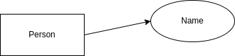
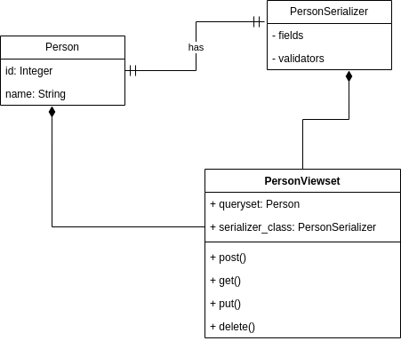

# Simple Person API Documentation

## Introduction

Welcome to the official documentation for https://hngx.kasyoki.africa/api/. This API is built on Django and uses an SQLite database. This document provides an overview of the key features, installation instructions, usage guidelines, and other important information about the app.

## Table of Contents

- [Installation](#installation)
- [UML Design Diagrams](#uml-design-diagrams)
- [API Endpoints and Examples](#api-endpoints)
- [Limitations](#limitations)

## Installation

1. Clone the repo
2. Change directory to the person_api directory. For linux `cd hngx2`
3. Install pip into your environment
4. Install pipenv using pip `pip install pipenv`
5. Create a virtual env with `pipenv shell`
6. Install requirements `pipenv install`
7. Create database tables `python manage.py migrate`
8. Run the API `python manage.py runserver`
9. Access the api at `http://localhost:8000/api/`

## UML Design Diagrams

### Person ERD



### API Design



## API Endpoints and Examples

Sections show the URL, and method type accepted

### `/api/` [GET]

- Lists all person resources stored in the database. The response contains a set of objects for all person resources stored.

- Response (Success: **200 OK**):

  ```
  [{ "id":1, "name":"Person Name" }]
  ```

### `/api/` [POST]

- Ensure the correact header is set i.e. `Content-Type:application/json`
- Creates a new person if called with POST. Accepts JSON:
  ```
  { "name" : "Person Name" }
  ```
- Response (Success : **201 Created**):
  ```
  [{ "id":1, "name":"Person Name" }]
  ```

### `/api/<int:user_id>/` [GET, PUT, DELETE]

#### GET

- For the GET, returns the id and name of the resource in the format

  - Response (Success : **200 OK**):
    ```
    {"id": 1, "name": "Person Name" }
    ```

#### PUT

- Ensure the correact header is set i.e. `Content-Type:application/json`
- For PUT, it allows the manipulation of a particular person resource stored in the API.

  Accepts JSON:

  ```
  { "name": "New Person Name" }
  ```

- PUT Response (Success : **200 OK**):
  ```
  {"id": 1, "name": "Person Name" }
  ```

#### DELETE

- For DELETE, it allows the removal of a particular person resource stored in the API.

- DELETE Response (Success : **204 No Content**):
  ```
  On success, the API returns an EMPTY response
  ```

## Limitations

- The API does not provide authentication of any kind
- The API is very basic and only stores a person's name
