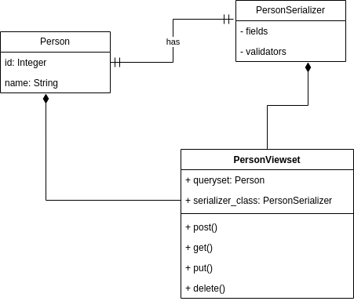

# Simple Person API Documentation

## Introduction

Welcome to the official documentation for https://hngx.kasyoki.africa/api/. This API is built on Django and uses an SQLite database. This document provides an overview of the key features, installation instructions, usage guidelines, and other important information about the app.

## Table of Contents

- [Installation](#installation)
- [UML Design](#designs)
- [API Endpoints and Examples](#api-endpoints)
- [Limitations](#limitations)

## Installation

1. Clone the repo
2. Install pip into your environment
3. Install pipenv using pip `pip install pipenv`
4. Change directory to the person_api directory. For linux `cd person_api`
5. Create a virtual env with `pipenv shell`
6. Install requirements `pipenv install`
7. Create database tables `python manage.py migrate`
8. Run the API `python manage.py runserver`

## UML Design

### Person Entity


### App Design



## API Endpoints and Examples

Sections show the URL, and method type accepted

### `/api/` [GET]

- Lists all person resources stored in the database. The response contains a set of objects for all person resources stored.

- Response (Success):

  ```
  [{ "id":1, "name":"Person Name" }]
  ```

### `/api/` [POST]

- Creates a new person if called with POST. Accepts JSON:
  ```
  { "name" : "Person Name" }
  ```
- Response (Success : 201):
  ```
  [{ "id":1, "name":"Person Name" }]
  ```

### `/api/<str:name>/` [GET, PUT, DELETE]

- For the GET, returns the id and name of the resource in the format

  - Response (Success : 200):
    ```
    {"id": 1, "name": "Person Name" }
    ```

- For PUT AND DELETE, It allows the manipulation of a particular person resource stored in the API.

  Accepts JSON:

  ```
  { "name": "New Person Name" }
  ```

- PUT Response (Success : 200):
  ```
  {"id": 1, "name": "Person Name" }
  ```
- DELETE Response (Success : 204)

## Testing

- A testing python script is provided for the https://hngx.kasyoki.africa/api/ endpoint. To run it in a localhost environment, use the test_localhost.py file.

## Limitations

- The API does not provide authentication of any kind
- The API is very basic and only stores a person's name
